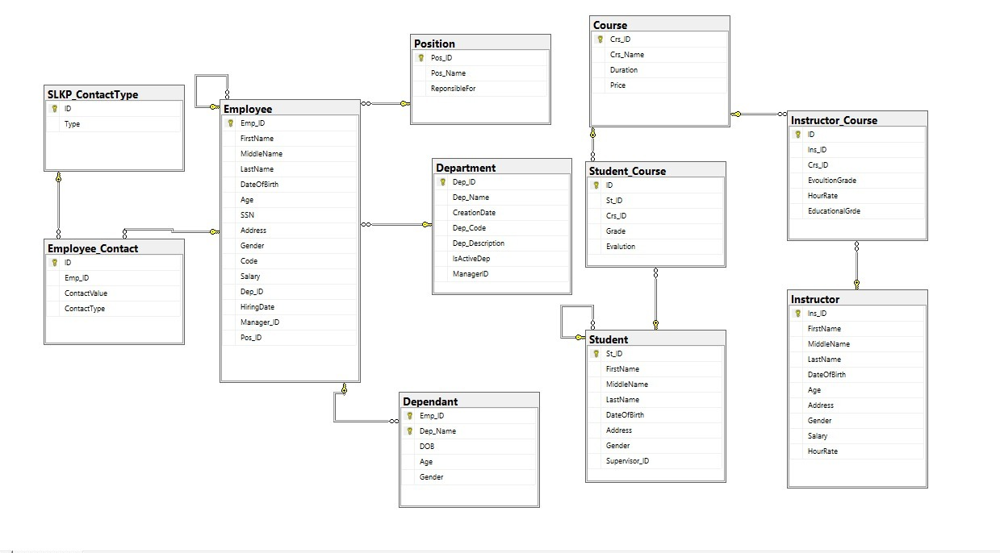

# Advanced-SQL-database-Queries

## Overview
Welcome to my SQL Server Practice Repository, featuring a diverse range of queries from simple to advanced levels, covering various topics such as:
- SQL (DDL, DML, DCL)
- Joins, Grouping, Subqueries
- DB Constraints & Rules
- Transactions, Ranking Functions
- Window Functions
- Variables
- Views, Indexes, Functions, Stored Procedures, Triggers, and more.

This repository is a practical 

## Database Schema

